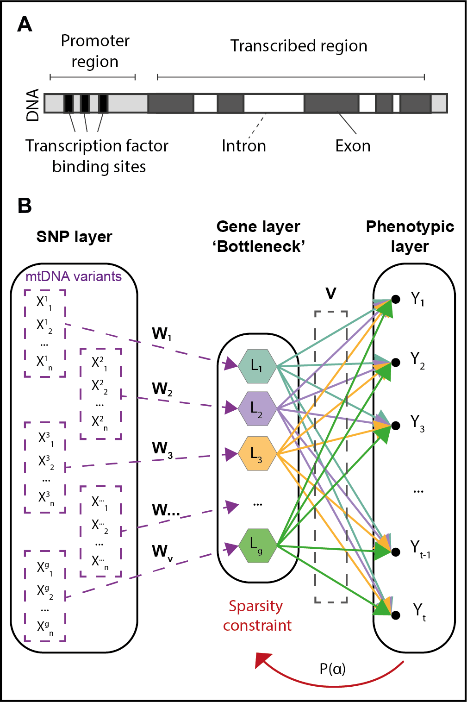

## Bayesian Genome-to-Phenome Sparse Regression

The Bayesian Genome-to-Phenome Sparse Regression (G2PSR) is a neural network which architecture associates genetic data to multiple phenotypic features through biologically inspired constraint (gene structure).



This repository contains the code related to G2PSR paper.

## Installation for GNU/Linux


Install conda:
```bash
wget https://repo.anaconda.com/miniconda/Miniconda3-latest-Linux-x86_64.sh  
bash Miniconda3-latest-Linux-x86_64.sh
```

Download this github repository and move into in:
```bash
git clone XXXXXX
cd g2psr
```

Install the customized python environment:
```bash
conda env create -f environment.yml
```

Activate the python environment:
```bash
conda activate g2psr
```

Load the `bayes_G2PSR.py` module into your script.
Examples can be found in the `test` sub-directory.
